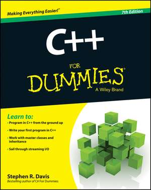

# C++ For Dummies – Book Practice in C++

**Practical C++ exercises inspired by the book “C++ For Dummies” by Stephen R. Davis**





---

## 🧠 Overview

This repository contains practical C++ examples and exercises inspired by the book *C++ For Dummies* by Stephen R. Davis.  
The goal of this project is to reinforce C++ programming concepts through real, hands-on examples and small programs.  
Each file demonstrates a specific concept from the book — from basic syntax and control flow to classes, pointers, templates, and modern C++ features.

---

## 🚀 What You’ll Learn

By exploring the code in this repository, you’ll gain experience with:

- Setting up a C++ development environment  
- Basic syntax, data types, and variables  
- Conditional statements and loops  
- Functions and modular programming  
- Pointers and dynamic memory allocation  
- Working with arrays and strings  
- Object-oriented programming (classes, inheritance, polymorphism)  
- Templates and the Standard Template Library (STL)  
- Exception handling and file input/output  
- Modern C++ techniques and debugging

---

## 🧩 Repository Structure

Each chapter or topic from the book is represented by a `.cpp` file.  
The corresponding `.exe` files are included for quick execution and testing.

```
📁 C-Plus-Plus-For-Dummies-by-Stephen-R-Davis-Book-Practice-in-C-Plus-Plus
 ┣ 📜 chapter_1.cpp
 ┣ 📜 chapter_2.cpp
 ┣ 📜 chapter_3.cpp
 ┣ 📜 ...
 ┣ 📜 chapter_27.cpp
 ┗ ⚙️ executables (.exe) for each chapter
```

---

## ⚙️ Requirements

To run the examples, you’ll need:

- A C++ compiler (e.g. `g++`, `clang++`, or Visual Studio)
- C++17 or newer standard support
- Command line or IDE to compile and run `.cpp` files

**Example (Linux/macOS/Windows with g++):**
```bash
g++ -std=c++17 chapter_1.cpp -o chapter_1
./chapter_1
```

---

## 🧰 How to Use

1. Clone the repository:
   ```bash
   git clone https://github.com/marius2347/C-Plus-Plus-For-Dummies-by-Stephen-R-Davis-Book-Practice-in-C-Plus-Plus.git
   ```
2. Navigate to the project folder:
   ```bash
   cd C-Plus-Plus-For-Dummies-by-Stephen-R-Davis-Book-Practice-in-C-Plus-Plus
   ```
3. Compile and run any `.cpp` file:
   ```bash
   g++ -std=c++17 chapter_5.cpp -o chapter_5
   ./chapter_5
   ```
4. Modify, experiment, and recompile to understand each concept better.

---

## 🎯 Who Is This For?

- Beginners learning C++ from scratch  
- Readers of *C++ For Dummies* who want to practice  
- Students and hobbyists exploring programming concepts  
- Developers looking for a refresher on C++ basics and beyond  

---

## 💡 Tips

- Start from the first chapter and progress step by step  
- Try to rewrite or modify examples to explore variations  
- Use an IDE (like Code::Blocks or Visual Studio) for easier debugging  
- Compile with `-Wall` to display helpful warnings and learn from them  

---

## 📬 Feedback

Created and maintained by **[Marius2347](https://github.com/marius2347)**  
If you find any bugs, improvements, or have suggestions, feel free to open an issue or contribute via pull request.

---

## ⭐ Support

If you found this repository helpful, please give it a **⭐ star** on GitHub — it helps others discover it and keeps the project growing!

---
